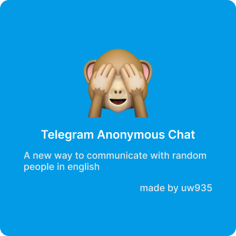

<br>
<p align="center">
    
    <h3 align="center">Telegram anonymous chat</h3>
    <p align="center">Chat-bot for communicate with random people in Telegram</p>
</p>
<br>

## About
This bot made for communication between random anonymous people


## Contributing

All the files here are under the MIT License. I'd really appreciate 

### Setting up an environment

```shell
cd src
python -m venv venv
.\venv\Scripts\activate
python -m pip install --upgrade pip
```

### Creating the database
```shell
python

>>> from db import engine
>>> from db.models.users import Base 
>>> Base.metadata.create_all(bind=engine)
```

### Starting application

```shell
python main.py
```


# TODO
- [x] routers folder <br>
- [x] states folder <br>
- [x] menu router base data<br>
- [x] connect db<br>
- [x] add more content to menu (start chat, change information in settings)<br>
- [x] add private chat router (user chating with people)<br>
- [x] add settings router (user can change his settings)<br>
- [x] abillity to send photos in private chats<br>
- [x] docker<br>
- [ ] interesting facts<br>
- [ ] more information to README.md<br>
- [ ] admin panel<br>
